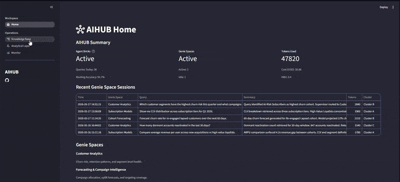

# AIHUB — Your Organisation's Brand Agent

<div align="center">
      
</div>

A Databricks-native intelligent application that automates the data lifecycle of your AI apps & Genie spaces by persisting chat histories and frequent questions in a unified graph memory network.

**Hackathon:** [Databricks Data & AI Apps 2026 Annual Hackathon](https://buildintelligentapps-databricks.com)

# Problem Statement

Businesses delivering AI based solutions on Databricks face a common bottleneck in evaluating AI agents in production. Genie Spaces, while powerful in isolation, operate without a shared memory layer — each requiring analysts to manually re-establish context, route queries, and reconstruct institutional knowledge from scratch every session.

Ultimatley, the key challenges:

- **Saturated data and possibility of model overfitting**: open sourced benchmarks saturate quickly and this may worsen when models fail to generalize to new or complex evaluation questions.
- **Fragmented memory across AgentBricks and Genie Spaces**: each session requires analysts to manually re-establish context, re-route queries to the appropriate analytical schema tables, and reconstruct contextual knowledge.
- **E2E Architectures for Reinforcement Learning**: AI agents require analysts to manually evaluate multiple Genie spaces as part of their day-to-day work which could reintroduce the bottlenecks that AI was trying to eliminate.

# Solution Overview

AIHUB addresses these challenges by establishing a graph network layer that simultaneously functions as an analytical layer and memory network.

The graph network serves as a common memory layer that persists your business definitions, metrics and previous agent/chat sessions to build a knowledge base governing all your agents. It aligns with Delta Lake Unity Catalog's architecture to create a near turing-complete data workflow - your agents' frontal cortex self organizes data and prioritised features on its own.

## Key Features

1. **AIHUB's persistent memory layer** is structured around two interconnected components:
   - **Analytical Layer** uses the vector representations of feature pools from Unity catalog to self organize clusters and assist in feature engineering segments. This is useful in domains where you are dealing with many multi-label features for e.g. customer needs from transactional dataset.
   - **Memory Graph Network** unifies historical AI chat sessions from AgentBricks and Genie Spaces to persist information on your business and organisation vibe. These traces are inferred to create and rank benchmarks for Genie spaces.

2. **Benchmark space for your Genie spaces**: automated agent orchestration to manage your entire evaluation benchmark for your Genie spaces — ensuring that agent performance is continuously measured, refined, and aligned with evolving business domains.

## Project Directory Summary

```bash
.
├── main.py                    # Streamlit App bootstrap entry point
├── requirements.txt           # App's dependencies
├── utils/                     # Streamlit & Databricks SDK config / utils helpers
├── app/                       # AIHub Core application package
│   ├── notebooks/             # Jupyter Notebook Demos
│   ├── src/                   # AIHub Source Scripts
│   └── tests/                 # Tests
└── pages/                     # Streamlit multipage
      ├── 1_knowledge_base.py    # Knowledge Graph Network Viewer
      ├── 2_monitor.py           # Genie Space Monitoring page
      └── Home.py                # Home/landing page & UI Chatbot with your Brand Agent
```

## Reference

- [Supervisor Agent Hierarchies](https://www.emergentmind.com/topics/supervisor-agent-hierarchies)
- [Building, Improving and Deploying Knowledge Graph RAG Systems on Databricks](https://www.databricks.com/blog/building-improving-and-deploying-knowledge-graph-rag-systems-databricks)
- [Graph Analysis Databricks Demos](https://docs.databricks.com/aws/en/machine-learning/graph-analysis)

> Built on the official Databricks [`streamlit-chatbot-app`](https://github.com/databricks/app-templates/tree/main/streamlit-chatbot-app) template, extended with supervisor agent orchestration, graph memory networking, and multi-Genie Space coordination.
> Full documentation lives in [`docs/`](docs/index.md) and is built with [MkDocs Material](https://squidfunk.github.io/mkdocs-material/).
