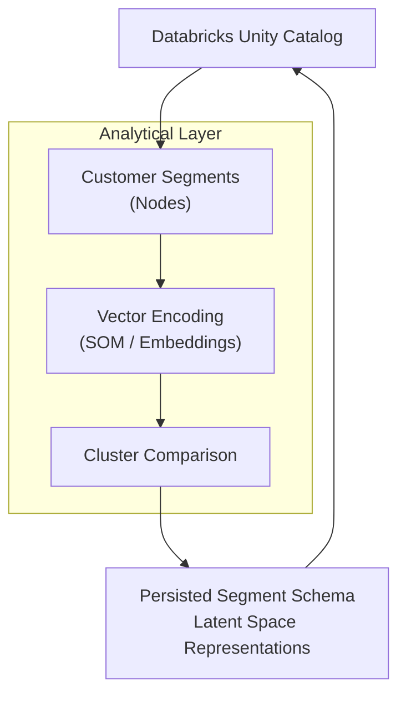

# Analytical Layer

AIHUB Analytical layer is graph memory network used to support multi-label features and business insights for Databrick's deployed apps, analysts and non-tech stakeholders.

## Overview

