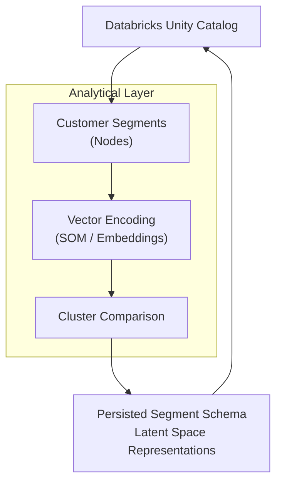

# Analytical Layer

- **Purpose:** Visualizes customer segments and clusters as a graph.
- **Key logic:**
  - Loads segment/cluster data from JSON
  - Renders interactive graph with pyvis
  - Shows legend and segment index
- **File:** `pages/2_Analytical_Layer.py`

## Overview

