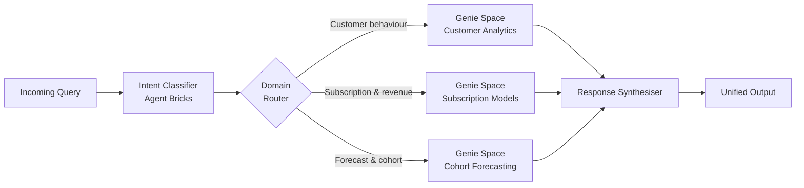
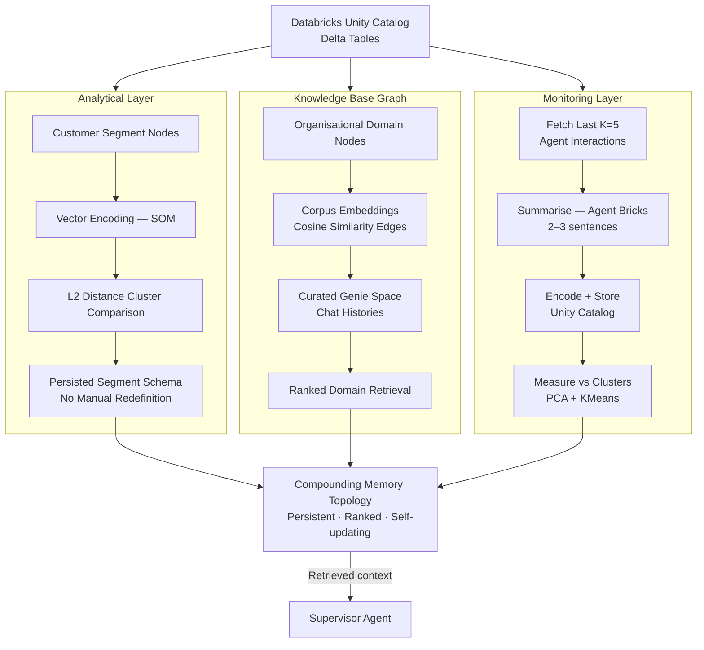

# AI Agentic Architecture

Brief on Brand Agent (Supervisor) and Genie Spaces.

## Supervisor Agent

A Supervisor Agent, built on Agent Bricks, performs two functions:

- **Chat History Summarisation & transformations** — incoming session/chat histories, traces on agent's thought process or SQL natural language queries are classified by context inferred from its vector space representation ( `sentence-transformers` ).
- **Query routing** — queries are routed to the appropriate Genie Space, organised by organisational context. For this proof of concept, the domain is customer churn and retention. Representative Genie Spaces include Customer Analytics, Subscription Models, and Customer Cohort Forecasting.

## Memory Layer

AIHUB addresses the absence of persistent state by constructing a unified memory layer, which concurrently serves as an analytical layer accessible to AI agents, analysts, and non-technical business users.

The memory layer is a structured data topology that organises information as an interconnected network. Rather than storing data in flat tables, it maps entities as **nodes** and relationships as **edges**.

Examples include:

- Nodes representing organisational domain members, with edges weighted by chat domain frequency.
- Nodes representing customer multi-label segments, connected to insights drawn from Agent Bricks and Genie Space interactions.

