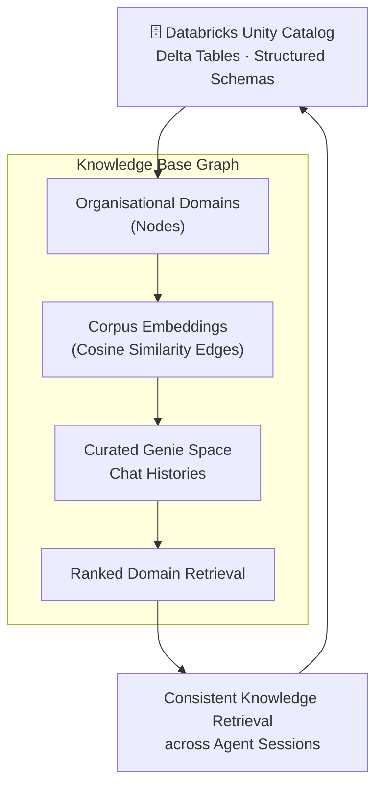

# AIHUB Graph Memory Network

AIHUB Graph Memory Network defines the Knowledge base shared across all AI agents deployed on Databricks.

## Overview

```mermaid
flowchart TD
    UC["🗄️ Databricks Unity Catalog\nDelta Tables · Structured Schemas"]
    UC --> K1

    subgraph KB["Knowledge Base Graph"]
        direction TB
        K1["Organisational Domains\n(Nodes)"]
        K2["Corpus Embeddings\n(Cosine Similarity Edges)"]
        K3["Curated Genie Space\nChat Histories"]
        K4["Ranked Domain Retrieval"]
        K1 --> K2 --> K3 --> K4
    end

    K4 --> OUT["Consistent Knowledge Retrieval\nacross Agent Sessions"]
    OUT --> UC
```
