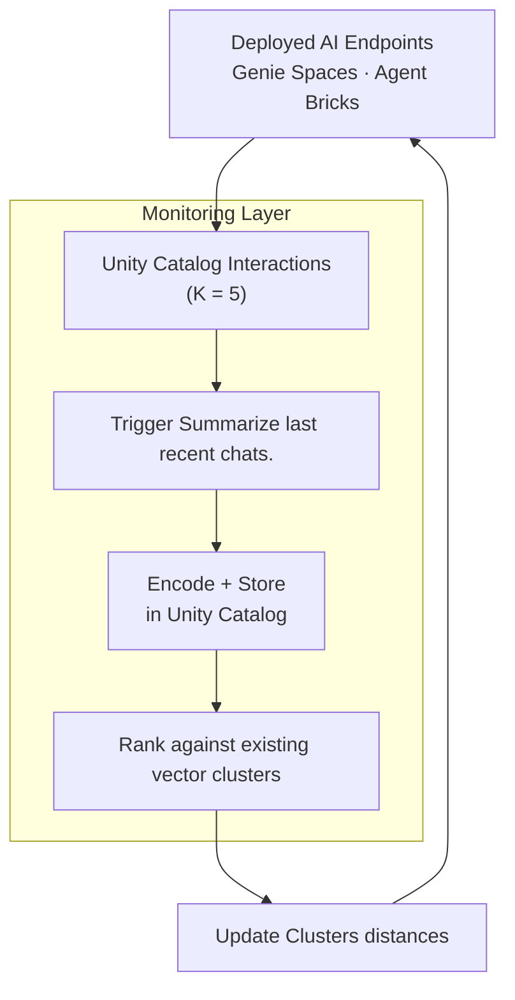

# AIHUB Post Prod Monitor

- **Purpose:** automates workflows on currently deployed AI Agent endpoints & Genie Spaces.
- **Page:** `pages/3_monitor.py`

## Overview

```mermaid
flowchart TD
    GS["Deployed AI Endpoints\nGenie Spaces · Agent Bricks"]
    GS --> M1

    subgraph ML["Monitoring Layer"]
        direction TB
        M1["Unity Catalog Interactions\n(K = 5)"]
        M2["Trigger Summarize last recent chats."]
        M3["Encode + Store\nin Unity Catalog"]
        M4["Rank against existing vector clusters"]
        M1 --> M2 --> M3 --> M4
    end

    M4 --> OUT["Update Clusters distances"]
    OUT --> GS
```
