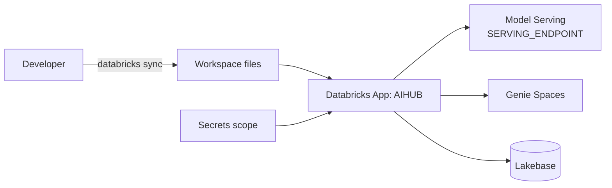

# Deploy as a Databricks App

AIHUB ships as a [Databricks App](https://docs.databricks.com/aws/en/dev-tools/databricks-apps/) — a Streamlit app run by the workspace with managed compute and secrets.

## What gets deployed

Two manifests at the repo root drive the deployment:

1. `app.yaml`

   ```yaml
   command: ["streamlit", "run", "main.py"]

   env:
     - name: STREAMLIT_BROWSER_GATHER_USAGE_STATS
       value: "false"
     - name: "SERVING_ENDPOINT"
       valueFrom: "serving-endpoint"
   ```

   - `command` is the entry process — Databricks Apps runs this from the app root.
   - `SERVING_ENDPOINT` is injected from the resource named `serving-endpoint` declared in `manifest.yaml`.

2. `manifest.yaml`

   ```yaml
   version: 1
   name: "AIHUB"
   description: "A Databricks-native supervisor agent app ..."

   resource_specs:
     - name: "serving-endpoint"
       description: "Model Serving endpoint used by the supervisor for orchestration and synthesis."
       serving_endpoint_spec:
         permission: "CAN_QUERY"
   ```

   Declares one Model Serving endpoint binding. The app's service principal needs `CAN_QUERY` on it.

## Deployment flow



## Step-by-step

1. **Install the Databricks CLI** (v0.205+) and authenticate:
   ```bash
   databricks auth login --host https://<your-workspace>.cloud.databricks.com
   ```
2. **Create / pick a Model Serving endpoint** the supervisor will call (e.g. an LLM endpoint). Note its name.
3. **Create a secrets scope** for the workspace and add Genie space IDs and any provider keys:
   ```bash
   databricks secrets create-scope aihub
   databricks secrets put-secret aihub openai-api-key
   databricks secrets put-secret aihub genie-customer-analytics
   # ...repeat per space ID
   ```
4. **Sync the repo** to a workspace folder:
   ```bash
   databricks sync --watch . /Workspace/Users/<you>/aihub
   ```
5. **Create the app** (one-time) in the workspace UI: **Compute → Apps → Create app → AIHUB**, pointing at the synced folder.
6. **Bind the resource** — when prompted, map the `serving-endpoint` resource to the endpoint chosen in step 2.
7. **Start the app**. The first run installs `requirements.txt` and launches `streamlit run main.py`.

## Permissions checklist

The app's service principal needs:

- `CAN_QUERY` on the Model Serving endpoint bound to `serving-endpoint`.
- `CAN_RUN` on each Genie Space the supervisor will route to.
- `READ` on the secrets scope (e.g. `aihub`).
- (If using Lakebase tables for memory) `SELECT`/`MODIFY` on the relevant Unity Catalog schema.
